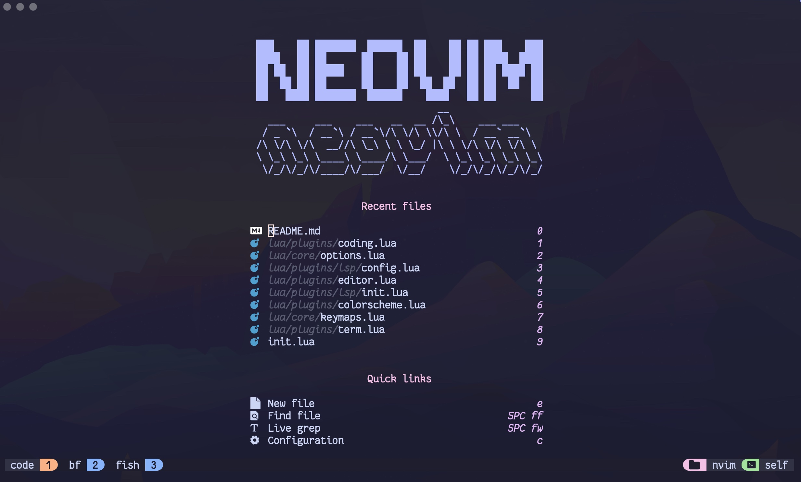
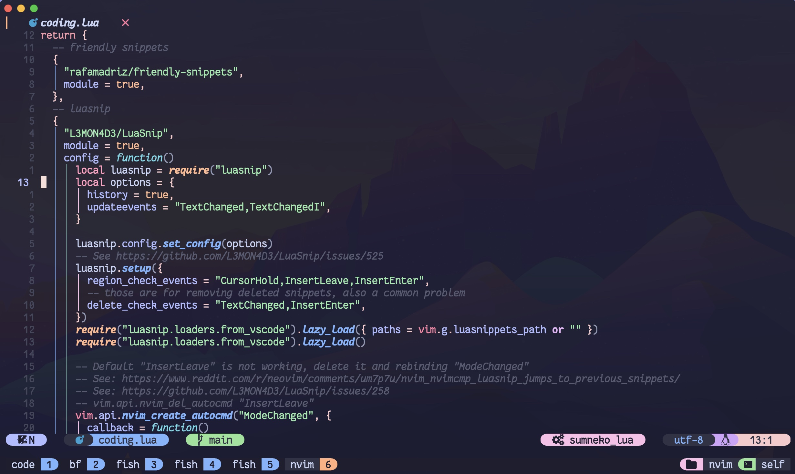

## Getting start

```sh
git clone git@github.com:22GNUs/nvimdots.git ~/.config/nvim && nvim
```

## Recommand Fonts

### FantasqueSansMono Nerd Font

```sh
brew tap homebrew/cask-fonts && brew install --cask font-fantasque-sans-mono-nerd-font
```

## Requements

### Lazygit(Optional)

```sh
brew install lazygit
```

### Glow(Optional)

```sh
brew install glow
```

## Preview

### Dashboard



### UI


